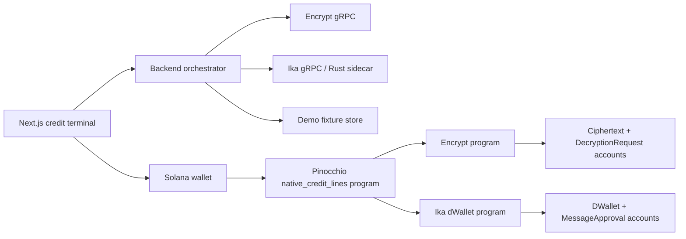

# Native Collateral Credit Lines - Corrected Hackathon Implementation Specification

## 0. Code Agent Prompt

You are building **Native Collateral Credit Lines** for the **Encrypt & Ika - Bridgeless Capital Markets and Encrypted Capital Markets** Frontier hackathon track.

RULE: If any idea in this prompt conflicts with the official docs, the official docs win.

Use this file as the single source of truth. Use the provided hackathon resources as the absolute source of truth.
 Do not broaden the product. Do not replace sponsor primitives with generic mocks except where this spec explicitly labels deterministic demo mode. Before coding, read the official docs and treat them as higher priority than this file if an API signature has changed:    READ THIS FIRST
Before making any architectural, product, UI, or coding decision, you must read and follow these official resources and treat them as the absolute source of truth:

- Encrypt docs: https://docs.encrypt.xyz/
- Ika Solana pre-alpha docs: https://solana-pre-alpha.ika.xyz/


Build an end-to-end demo where a borrower opens a confidential pcUSDC-style credit line on Solana using native BTC-style collateral controlled by an Ika dWallet. The Solana program must use Encrypt for private collateral value, debt, borrow, repayment, release eligibility, and liquidation eligibility computation. The Solana program must use Ika to approve a native-chain message signature only after the relevant policy bit has been computed by Encrypt, decrypted through the official `request_decryption` flow, and digest-verified on-chain.

Strict priorities:

1. Sponsor integration is the product core, not decoration.
2. The MVP demonstrates both sponsor systems in one coherent lending workflow.
3. The demo is reliable on Solana devnet/pre-alpha and has a clearly marked deterministic fallback.
4. Scope fits 5 weeks for a focused full-stack team.
5. The UI is premium, modern, glassmorphism, and technically transparent.
6. No generic wallet, bridge, NFT marketplace, token launcher, AI wrapper, or vague consumer app.

Corrected implementation defaults:

- Program framework: **Pinocchio** by default, because both Encrypt and Ika officially support Pinocchio 0.10. Do not start with Anchor unless the latest docs confirm one compatible Anchor version for both sponsor SDKs.
- Monetary FHE type: `EUint64` for MVP using USD cents and bounded demo values. Use `EUint128` only as a stretch if tests prove the graph and client path are stable.
- Confidential branching: never branch directly from encrypted booleans into Ika signing. Use a two-phase policy flow: compute encrypted eligibility, request decryption, verify digest, then call `approve_message`.
- Collateral scope: BTC-style collateral is mandatory. ETH-style collateral is optional after the BTC flow is complete.
- pcUSDC scope: implement a confidential demo credit ledger inspired by Encrypt PC-Token patterns. A production SPL/PC-Token stablecoin is out of scope unless the team finishes the core sponsor flow early.

Frontend mandate:

- The first screen is the working credit terminal, not a marketing landing page.
- Build a dark institutional glassmorphism UI with translucent panels, crisp borders, high contrast, polished loading/error/empty states, and no overlapping text at mobile or desktop sizes.
- Expose sponsor primitives directly: EncryptDeposit status, ciphertext accounts, graph execution, decryption request/digest verification, Ika GasDeposit status, dWallet authority, MessageApproval state, and signature bytes.
- Use `lucide-react` icons for actions and status indicators.
- Every disabled button must explain the missing precondition.

Final submission must include a public GitHub repo, README, deployed program IDs or deterministic demo instructions, build/test/use instructions, and a video under 5 minutes.

## 1. Official Resource Audit And Repairs

### Official Facts Incorporated

- Encrypt pre-alpha has no real encryption guarantee; data is public/plaintext on-chain and must not contain real sensitive data.
- Encrypt programs use `#[encrypt_fn]` to compile Rust-like FHE logic into graphs. On-chain `execute_graph` creates or updates ciphertext accounts; the off-chain executor commits results; `request_decryption` creates a request that the decryptor answers.
- Encrypt ciphertext accounts are regular Solana accounts owned by Encrypt. The ciphertext account pubkey is the ciphertext identifier and includes `authorized`, `fhe_type`, and `status`.
- Encrypt comparisons return the same encrypted integer type as the operands, with value `0` or `1`, not `EBool`.
- Encrypt operations require an `EncryptDeposit` fee account for graph execution, plaintext ciphertext creation, input creation, and decryption requests.
- Ika pre-alpha uses a single mock signer, not production distributed MPC. Do not claim production custody security.
- Ika dWallets are controlled by a Solana account authority. A program controls a dWallet only after authority is transferred to the program CPI authority PDA derived from seed `__ika_cpi_authority`.
- Ika `approve_message` creates a `MessageApproval` PDA under the dWallet program. The Ika network detects it and later writes the signature on-chain.
- Ika programs need a `GasDeposit` PDA containing IKA and SOL balances for dWallet operation fees and NOA write-back costs.
- Ika supports Secp256k1 for Bitcoin/Ethereum-style signing and schemes including `EcdsaKeccak256`, `EcdsaDoubleSha256`, and `TaprootSha256`.
- Hackathon judging rewards core Ika/Encrypt integration, innovation, technical execution, product/commercial potential, impact, usability, and completeness.

### Repairs From Previous Spec

- Replaced Anchor-first guidance with Pinocchio-first guidance to avoid SDK version mismatch risk.
- Added mandatory EncryptDeposit and Ika GasDeposit setup.
- Replaced direct "encrypted condition triggers Ika signing" with digest-verified decryption gate.
- Removed private health-ratio division from the critical path. The critical liquidation check uses cross-multiplication.
- Narrowed the mandatory collateral path to BTC-style collateral, with ETH-style signing as stretch.
- Clarified that pcUSDC is a confidential demo credit ledger, not a production stablecoin.
- Corrected MessageApproval derivation ownership: it belongs to the Ika dWallet program, not the lending program.
- Added explicit PolicyReveal state to bridge Encrypt policy outputs to Ika signing safely.

## 2. Product Overview

**Native Collateral Credit Lines** is a private, bridgeless credit protocol demo for institutional crypto desks. A borrower creates an Ika dWallet that represents native BTC-style collateral custody, transfers that dWallet authority to a Solana lending program, then draws confidential pcUSDC-style credit while debt, collateral value, and policy checks are computed with Encrypt.

The product proves one specific primitive: **Solana can act as a private credit-control layer for native cross-chain collateral without requiring a bridge or public borrower risk exposure.**

The MVP is a pre-alpha hackathon demo. It must not ask for real BTC, real ETH, real private data, or production funds.

## 3. Problem Statement

Institutional crypto desks, market makers, and treasuries often hold native BTC but need USDC liquidity for trading or operations. Existing choices are weak:

- bridging/wrapping BTC introduces bridge risk and liquidity fragmentation;
- centralized lenders introduce counterparty and custody risk;
- public on-chain lending reveals collateral size, debt, liquidation proximity, and strategy.

The painful gap: desks need credit against native collateral while keeping risk data confidential and keeping collateral movement governed by enforceable program logic.

## 4. Hackathon Fit And First-Prize Strategy

### Track Fit

The MVP directly targets the track:

- **Bridgeless capital markets:** Ika dWallets allow a Solana program to control signing for native BTC-style collateral without wrapping or bridging.
- **Encrypted capital markets:** Encrypt computes borrow limits, repayment updates, release eligibility, and liquidation eligibility over ciphertext accounts.
- **Hybrid solution:** The strongest demo moment is when Encrypt computes a private liquidation/release policy bit and Ika signs only after that bit is digest-verified.

### First-Prize Strategy

Judges should see that:

- without Encrypt, borrower debt and liquidation risk become public;
- without Ika, native collateral release/liquidation becomes bridge-based or custodial;
- without Solana, there is no fast, programmable, low-cost coordination layer for the credit state machine and signing authorization.

### Submission Fit

The repo must include:

- public GitHub source;
- README explaining problem, target users, Encrypt usage, Ika usage, build/test/use instructions, deployed IDs, and pre-alpha disclaimers;
- short demo video under 5 minutes;
- frontend link or local run instructions;
- tests or deterministic demo script.

## 5. Target Users And Roles

### Borrower

Institutional crypto desk, market maker, treasury operator, or fund.

Needs:

- borrow against native BTC-style collateral without wrapping;
- keep borrow amount, debt, and liquidation proximity private;
- release collateral after repayment.

### Lender / Pool Manager

Stablecoin lender, credit desk, DAO treasury, or demo pool operator.

Needs:

- provide confidential pcUSDC-style liquidity;
- see aggregate utilization without borrower-specific public risk leakage;
- trigger liquidation when a private policy check proves eligibility.

### Demo Operator

Hackathon presenter.

Needs:

- seed a reproducible scenario;
- top up required sponsor deposits;
- stress collateral price;
- recover from pre-alpha service failures with deterministic demo mode.

## 6. Product Decisions And Explicit Assumptions

### Mandatory MVP Decisions

- Mandatory collateral asset: BTC-style collateral using Secp256k1 dWallet and `EcdsaDoubleSha256` for BIP143-style demo digest.
- Optional collateral asset: ETH-style collateral using Secp256k1 dWallet and `EcdsaKeccak256`.
- The app signs mocked native-chain transaction digests. It does not broadcast BTC/ETH transactions.
- The app uses demo collateral attestations and demo price updates. It does not integrate a real oracle.
- Monetary values use USD cents as `u64` to keep `EUint64` arithmetic sufficient.
- Risk parameters:
  - max borrow LTV: 60%;
  - liquidation LTV: 75%;
  - release requires decrypted `release_eligible == 1`;
  - liquidation requires decrypted `liquidation_eligible == 1`.
- Interest accrual is out of scope for MVP. Display APR as a business placeholder only if clearly labeled "not accrued in demo".

### Assumptions

- The team can deploy one Pinocchio program to Solana devnet.
- The team can use official pre-alpha devnet endpoints for Encrypt and Ika.
- The team can maintain a local Rust or TypeScript backend connector for sponsor gRPC calls.
- If pre-alpha APIs change, implementation must follow the latest official docs while preserving this behavior.
- Deterministic demo mode is allowed only for resilience and video capture; the real-mode path must remain visible.

## 7. What To Build

Build exactly this MVP:

1. Premium borrower/lender credit terminal.
2. EncryptDeposit setup/top-up status for the borrower/demo operator.
3. Ika GasDeposit setup/top-up status for dWallet operations.
4. Ika BTC-style dWallet creation through DKG.
5. Authority transfer from borrower to the lending program CPI authority PDA.
6. Demo collateral attestation for native BTC-style collateral.
7. Encrypt ciphertext accounts for collateral value, debt, pool liquidity, borrow result, release eligibility, and liquidation eligibility.
8. Confidential borrow graph that updates debt and pool liquidity only if encrypted policy passes.
9. Confidential repay graph that decreases debt without underflow.
10. Release policy graph, decryption request, digest verification, then Ika `approve_message` for release.
11. Liquidation policy graph, decryption request, digest verification, then Ika `approve_message` for liquidation.
12. Proof page showing transaction signatures, ciphertext accounts, decryption requests, dWallet account, MessageApproval account, and signature bytes.
13. Deterministic demo mode that mirrors the exact state machine.

## 8. What Not To Build

Do not build:

- real BTC/ETH deposits or broadcasts;
- production PC-Token integration unless the core flow is complete;
- real oracle integration;
- multi-pool lending;
- variable-rate interest;
- undercollateralized credit;
- liquidation auctions;
- insurance funds;
- KYC/compliance;
- DAO governance;
- generic multisig/wallet features;
- AI agents;
- production privacy, production MPC, or production custody claims.

## 9. Core User Journeys

### Journey A: Setup Required Deposits

1. User connects a Solana wallet on devnet.
2. App checks EncryptDeposit for graph/decryption fees.
3. App checks Ika GasDeposit for DKG/signing/NOA write-back fees.
4. If either deposit is missing or low, UI guides the user through create/top-up.
5. Proof timeline records deposit accounts.

Acceptance criteria:

- Mutating actions are blocked until the required deposit account exists.
- UI distinguishes EncryptDeposit from Ika GasDeposit.

### Journey B: Create Native Collateral Vault

1. Borrower selects BTC-style collateral.
2. Backend submits Ika DKG request through the official Ika gRPC path.
3. UI polls until the dWallet state is `Active`.
4. Borrower transfers dWallet authority to the lending program CPI authority PDA.
5. Program verifies the dWallet curve is Secp256k1 and authority is the expected CPI PDA.

Acceptance criteria:

- UI shows dWallet public key, curve, state, authority, and attestation/digest references.
- Release/liquidation buttons stay disabled until authority is program-controlled.

### Journey C: Activate Confidential Credit Line

1. Demo operator issues a signed collateral attestation:
   - loan id;
   - asset;
   - native address;
   - native deposit digest;
   - demo BTC amount;
   - demo BTC price;
   - USD cents collateral value.
2. Client creates or requests a ciphertext input for collateral value authorized to the lending program.
3. Program creates plaintext ciphertext for zero debt and seeded pool liquidity where needed.
4. Program calls `compute_limit_graph` to produce encrypted borrow limit.
5. Loan status becomes `Active`.

Acceptance criteria:

- Collateral value and debt are represented by ciphertext accounts.
- Attestation is visibly demo-only.
- UI shows that ciphertexts are pending until committed/verified by Encrypt.

### Journey D: Borrow Confidential pcUSDC Credit

1. Borrower enters amount in USD cents.
2. Client creates encrypted borrow amount input authorized to the lending program.
3. Program calls `borrow_graph`.
4. Graph computes encrypted `valid_flag`, updated debt, and updated pool liquidity.
5. Program stores output ciphertexts and a public transaction signature.
6. UI shows borrow status and policy output without revealing debt by default.

Acceptance criteria:

- A valid borrow updates encrypted debt.
- An over-limit borrow results in no encrypted debt increase.
- Proof page shows graph execution and output ciphertext accounts.

### Journey E: Repay Confidential pcUSDC Credit

1. Borrower enters repayment amount.
2. Client creates encrypted repayment amount input.
3. Program calls `repay_graph`.
4. Graph computes `actual_repay = min(repay_amount, debt)`.
5. Graph updates encrypted debt and pool liquidity.
6. UI enables release policy check after repayment scenario.

Acceptance criteria:

- Partial repay decreases debt.
- Over-repay cannot produce negative debt.
- Repay flow does not require revealing debt.

### Journey F: Release Collateral After Repayment

1. Borrower clicks "Check release".
2. Program calls `release_policy_graph`, outputting encrypted `release_eligible` as 0/1.
3. Program requests decryption of that output and stores the ciphertext digest snapshot.
4. UI polls until decryptor responds.
5. Borrower or keeper calls `finalize_release_policy`.
6. Program uses `read_decrypted_verified` or the current official equivalent to verify digest and result.
7. If result is 1, program calls Ika `approve_message` for a release digest.
8. UI polls MessageApproval until status is signed and displays signature bytes.

Acceptance criteria:

- Release cannot call Ika before digest-verified eligibility equals 1.
- Outstanding debt produces no release MessageApproval.
- Replay using an old nonce is rejected.

### Journey G: Liquidate After Price Stress

1. Demo operator stresses BTC price through the backend.
2. Backend issues a new demo price/collateral-value attestation.
3. Program updates encrypted collateral value through a graph/input flow.
4. Liquidator clicks "Check liquidation".
5. Program calls `liquidation_policy_graph`, outputing encrypted `liquidation_eligible`.
6. Program requests decryption, stores digest, then finalizes only after digest verification.
7. If result is 1, program calls Ika `approve_message` for a liquidation digest.
8. UI shows MessageApproval pending/signed and signature bytes.

Acceptance criteria:

- Healthy loan cannot create liquidation MessageApproval.
- Unhealthy loan creates liquidation MessageApproval after verified policy reveal.
- Only the binary liquidation eligibility is revealed.

## 10. Functional Requirements

### FR-1 Wallet And Network

- Use Solana wallet adapter.
- Devnet only.
- Show wallet pubkey, SOL balance, and network.
- Block mutations without wallet or wrong network.

### FR-2 EncryptDeposit

- Detect or create user/demo `EncryptDeposit`.
- Top up demo ENC/SOL balances if required by pre-alpha environment.
- Pass the deposit account to every Encrypt instruction that requires fees.
- Show deposit account, ENC balance, gas balance, and last fee-consuming operation.

### FR-3 Ika GasDeposit

- Detect or create Ika `GasDeposit`.
- Top up IKA/SOL demo balances where required.
- Use the deposit for DKG/signing/NOA write-back flows according to the latest Ika docs.
- Show deposit status before dWallet creation/signing.

### FR-4 dWallet Vault

- Create dWallet through Ika DKG.
- Store dWallet account pubkey, public key, curve, state, authority, attestation references, and created epoch.
- Transfer authority to CPI authority PDA derived with `[b"__ika_cpi_authority"]` and program id.
- Verify Secp256k1 for BTC/ETH-style signing.

### FR-5 Collateral Attestation

- Backend issues demo-only signed attestation.
- Program stores attestation metadata and verifies issuer.
- Attestation expires after configured slots/time.
- Collateral value is stored as encrypted USD cents.

### FR-6 Confidential Pool Ledger

- Implement a single pool with encrypted available liquidity and encrypted total debt.
- Public utilization hints are allowed for demo UX but must be labeled approximate/revealed.
- No real USDC/SPL transfers are required in MVP.

### FR-7 Borrow

- Borrower submits encrypted amount.
- Program calls Encrypt graph with debt, pool liquidity, collateral value, and amount.
- Graph outputs final debt, final pool liquidity, and valid flag.
- Output ciphertexts must reach verified status before UI marks operation complete.

### FR-8 Repay

- Borrower submits encrypted repay amount.
- Graph clamps repayment to current debt.
- Output debt cannot underflow.

### FR-9 Policy Reveal

- Release and liquidation policy checks use the official decryption flow.
- Program stores digest returned by `request_decryption`.
- Program finalizes only after verifying decrypted result against stored digest.
- Program reveals only policy bits, not debt or collateral values.

### FR-10 Ika MessageApproval

- Program calls `approve_message` only after verified policy reveal.
- Message digest is 32 bytes.
- Use Ika SDK PDA helpers where available to derive MessageApproval accounts.
- UI polls status offset or SDK reader until `Signed`.

### FR-11 Deterministic Demo Mode

- Demo mode mirrors the same states and IDs but is clearly labeled.
- Demo mode cannot be confused with production or devnet success.
- Demo mode must support the full video path if pre-alpha services are wiped.

## 11. Non-Functional Requirements

### Reliability

- Every sponsor call has loading, success, failure, retry, and timeout states.
- Poll Encrypt outputs every 2 seconds until verified or timed out.
- Poll Ika MessageApproval every 2 seconds until signed or timed out.
- After 60 seconds, continue polling with exponential backoff and show "still pending".

### Usability

- Main demo path must finish in under 5 minutes.
- Use product language in primary UI and technical language on `/proofs`.
- Buttons must remain stable size across state changes.

### Maintainability

- Shared TypeScript schemas for frontend/backend API contracts.
- Sponsor connectors isolated under `lib/encrypt` and `lib/ika`.
- Program constants exported to frontend config.

### Accessibility

- WCAG AA contrast.
- Keyboard navigable.
- Visible focus states.
- Status chips include icon and text.
- Charts include text equivalents.

## 12. System Architecture

### Components

1. **Next.js Web App**
   - Borrower terminal.
   - Lender/liquidator view.
   - Proof explorer.
   - Demo operator console.

2. **Backend Orchestrator**
   - Next.js route handlers or a small Node/Bun service.
   - Encrypt TS gRPC connector using `@encrypt.xyz/pre-alpha-solana-client`.
   - Ika connector via Rust sidecar using `ika-grpc` and `ika-dwallet-types`, unless the latest repo-confirmed TS client is stable.
   - Demo attestation issuer.
   - Price fixture manager.

3. **Pinocchio Solana Program**
   - Lending state machine.
   - Encrypt CPI through `encrypt-pinocchio`.
   - Ika CPI through `ika-dwallet-pinocchio`.
   - PolicyReveal digest verification and Ika approval gating.

4. **Encrypt Pre-Alpha Network**
   - Ciphertext creation.
   - Graph execution.
   - Commit ciphertext.
   - Decryption request/response.

5. **Ika Pre-Alpha Network**
   - dWallet DKG.
   - MessageApproval monitoring.
   - Mock pre-alpha signature commitment.



## 13. Solana Program Specification

### Program Name

`native_credit_lines`

### Framework

Use Pinocchio:

- `encrypt-pinocchio`
- `ika-dwallet-pinocchio`
- `pinocchio = "0.10"`
- `pinocchio-system = "0.5"`

Do not use Anchor as default because the current official docs list different Anchor dependency generations across Encrypt and Ika.

### Constants

- `MAX_BORROW_LTV_BPS = 6000`
- `LIQUIDATION_LTV_BPS = 7500`
- `BPS_DENOMINATOR = 10000`
- `USD_SCALE = 100`
- `ASSET_BTC = 1`
- `ASSET_ETH = 2` optional
- `POLICY_RELEASE = 1`
- `POLICY_LIQUIDATION = 2`
- `MESSAGE_ACTION_RELEASE = 1`
- `MESSAGE_ACTION_LIQUIDATE = 2`

### Program-Owned PDA Seeds

- Pool: `["pool", pool_id]`
- Loan: `["loan", borrower, loan_id]`
- Attestation: `["attestation", loan, attestation_id]`
- PolicyReveal: `["policy_reveal", loan, action, nonce]`
- Used nonce: `["used_nonce", loan, action, nonce]`

### Ika CPI Authority PDA

- Seed: `[b"__ika_cpi_authority"]`
- Program: `native_credit_lines` program id
- Required before program can approve any dWallet message.

### Account: `Pool`

Fields:

- `authority: Pubkey`
- `pool_id: [u8; 32]`
- `encrypted_liquidity_ct: Pubkey`
- `encrypted_total_debt_ct: Pubkey`
- `public_utilization_hint_bps: u16`
- `paused: bool`
- `created_at_slot: u64`
- `updated_at_slot: u64`
- `bump: u8`

### Account: `LoanPosition`

Fields:

- `loan_id: [u8; 32]`
- `borrower: Pubkey`
- `pool: Pubkey`
- `asset: u8`
- `status: LoanStatus`
- `dwallet: Pubkey`
- `dwallet_public_key: [u8; 65]`
- `dwallet_public_key_len: u8`
- `native_collateral_address_hash: [u8; 32]`
- `collateral_value_ct: Pubkey`
- `debt_ct: Pubkey`
- `borrow_limit_ct: Pubkey`
- `last_borrow_valid_ct: Pubkey`
- `release_eligible_ct: Pubkey`
- `liquidation_eligible_ct: Pubkey`
- `max_ltv_bps: u16`
- `liquidation_ltv_bps: u16`
- `release_nonce: u64`
- `liquidation_nonce: u64`
- `pending_release_policy: Pubkey`
- `pending_liquidation_policy: Pubkey`
- `pending_release_message_approval: Pubkey`
- `pending_liquidation_message_approval: Pubkey`
- `created_at_slot: u64`
- `updated_at_slot: u64`
- `bump: u8`

### Enum: `LoanStatus`

- `Draft`
- `VaultReady`
- `Active`
- `ReleaseCheckPending`
- `ReleasePendingSignature`
- `Released`
- `LiquidationCheckPending`
- `LiquidationPendingSignature`
- `Liquidated`
- `Frozen`

### Account: `CollateralAttestation`

Fields:

- `loan: Pubkey`
- `issuer: Pubkey`
- `asset: u8`
- `native_tx_digest: [u8; 32]`
- `amount_native_scaled: u64`
- `price_usd_cents: u64`
- `value_usd_cents_commitment: [u8; 32]`
- `created_at_slot: u64`
- `expires_at_slot: u64`
- `used: bool`
- `bump: u8`

### Account: `PolicyReveal`

Fields:

- `loan: Pubkey`
- `action: u8`
- `nonce: u64`
- `eligibility_ct: Pubkey`
- `decryption_request: Pubkey`
- `ciphertext_digest_snapshot: [u8; 32]`
- `status: PolicyRevealStatus`
- `decrypted_value: u64`
- `message_digest: [u8; 32]`
- `message_approval: Pubkey`
- `created_at_slot: u64`
- `expires_at_slot: u64`
- `bump: u8`

### Enum: `PolicyRevealStatus`

- `None`
- `DecryptionRequested`
- `VerifiedEligible`
- `VerifiedIneligible`
- `MessageApproved`
- `Expired`

### Instructions

#### `initialize_pool`

Creates a single confidential demo pool.

Required accounts:

- payer;
- pool PDA;
- initial encrypted liquidity ciphertext;
- initial encrypted total debt ciphertext;
- EncryptDeposit;
- Encrypt fixed accounts required by `create_plaintext_ciphertext` or current helper.

Validation:

- authority signs;
- initial liquidity ciphertext is `EUint64`;
- total debt is encrypted zero.

#### `create_loan`

Creates loan in `Draft`.

Inputs:

- loan id;
- asset id;
- dWallet account;
- native collateral address hash.

Validation:

- borrower signs;
- asset is BTC for MVP;
- dWallet state is active if readable;
- dWallet curve is Secp256k1.

#### `mark_vault_ready`

Verifies dWallet authority equals program CPI authority and moves loan to `VaultReady`.

Validation:

- borrower signs;
- dWallet authority matches CPI authority PDA;
- dWallet not frozen.

#### `attach_attestation`

Stores demo collateral attestation and collateral value ciphertext.

Validation:

- issuer equals configured demo issuer;
- attestation not expired;
- attestation asset matches loan asset;
- collateral value ciphertext type is `EUint64`;
- loan status is `VaultReady`.

#### `activate_loan`

Creates encrypted zero debt if needed and computes borrow limit.

Graph:

- `borrow_limit = collateral_value * 6000 / 10000`

Validation:

- loan is `VaultReady`;
- EncryptDeposit account is passed;
- ciphertexts are verified or pending according to current official constraints;
- output borrow limit ciphertext is writable.

#### `borrow`

Runs private borrow policy.

Graph:

- `new_debt = debt + amount`
- `limit = collateral_value * 6000 / 10000`
- `has_liquidity = pool_liquidity >= amount`
- `within_ltv = new_debt <= limit`
- `valid = has_liquidity & within_ltv`
- `final_debt = if valid { new_debt } else { debt }`
- `final_pool_liquidity = if valid { pool_liquidity - amount } else { pool_liquidity }`
- `valid_flag = valid`

Validation:

- borrower signs;
- loan active;
- pool not paused;
- all ciphertexts are `EUint64`;
- outputs use update mode where appropriate.

#### `repay`

Runs private repay graph.

Graph:

- `actual_repay = repay_amount.min(debt)`
- `final_debt = debt - actual_repay`
- `final_pool_liquidity = pool_liquidity + actual_repay`

Validation:

- borrower signs;
- loan active;
- pool not paused.

#### `request_release_policy`

Computes release eligibility and requests decryption.

Graph:

- `release_eligible = debt == 0`

Flow:

1. Execute graph to output `release_eligible_ct`.
2. After output is committed/verified, call `request_decryption` on `release_eligible_ct`.
3. Store digest snapshot in `PolicyReveal`.

Validation:

- borrower signs;
- nonce unused;
- loan active;
- action is release.

#### `finalize_release_policy_and_approve`

Reads decryption result, verifies digest, and calls Ika `approve_message` if eligible.

Validation:

- decrypted result equals 1;
- digest matches stored snapshot;
- dWallet authority is still CPI authority PDA;
- MessageApproval PDA was derived according to Ika docs/SDK;
- nonce not previously used.

Side effect:

- calls Ika `approve_message`;
- status becomes `ReleasePendingSignature`;
- stores MessageApproval pubkey.

#### `request_liquidation_policy`

Computes liquidation eligibility and requests decryption.

Graph:

- `liquidation_eligible = debt * 10000 >= collateral_value * 7500`

Validation:

- loan active;
- nonce unused;
- price/collateral attestation still current.

#### `finalize_liquidation_policy_and_approve`

Reads decryption result, verifies digest, and calls Ika `approve_message` if eligible.

Validation:

- decrypted result equals 1;
- digest matches stored snapshot;
- dWallet authority is still CPI authority PDA;
- MessageApproval PDA was derived according to Ika docs/SDK;
- nonce not previously used.

## 14. Encrypt Graph Specification

Use `EUint64` for all MVP encrypted monetary values. Values are USD cents. Demo max values must stay below `1_000_000_000_000` cents to leave safe multiplication headroom.

### `compute_limit_graph`

Inputs:

- `collateral_value: EUint64`

Outputs:

- `borrow_limit: EUint64`

Formula:

- `collateral_value * 6000 / 10000`

### `borrow_graph`

Inputs:

- `debt: EUint64`
- `pool_liquidity: EUint64`
- `collateral_value: EUint64`
- `amount: EUint64`

Outputs:

- `final_debt: EUint64`
- `final_pool_liquidity: EUint64`
- `valid_flag: EUint64`

Formula:

- as defined in `borrow`.

### `repay_graph`

Inputs:

- `debt: EUint64`
- `pool_liquidity: EUint64`
- `repay_amount: EUint64`

Outputs:

- `final_debt: EUint64`
- `final_pool_liquidity: EUint64`
- `actual_repay: EUint64`

### `release_policy_graph`

Inputs:

- `debt: EUint64`

Outputs:

- `release_eligible: EUint64`

Formula:

- `debt == 0`

### `liquidation_policy_graph`

Inputs:

- `debt: EUint64`
- `collateral_value: EUint64`

Outputs:

- `liquidation_eligible: EUint64`

Formula:

- `debt * 10000 >= collateral_value * 7500`

### Encrypt Implementation Rules

- Use `#[encrypt_fn]` and generated CPI extension traits.
- Use `EncryptContext` from `encrypt-pinocchio`.
- Use update mode for debt and pool liquidity when stable.
- Use `create_plaintext_ciphertext` for encrypted zeros and seeded demo liquidity.
- Use `create_input_ciphertext` or official gRPC client flow for user/demo encrypted inputs.
- Pass `EncryptDeposit` to each fee-consuming Encrypt instruction.
- Track statuses: Pending, Verified, DecryptionRequested, DecryptionResponded.
- For release/liquidation, store digest from `request_decryption` and verify before Ika approval.

## 15. Ika dWallet Integration Specification

### dWallet Creation

- Submit DKG request through Ika gRPC.
- Use Secp256k1 curve for BTC-style collateral.
- Poll until DWallet account state is `Active`.
- Store dWallet public key and public key length.

### Authority Transfer

- Borrower transfers dWallet authority to the program CPI authority PDA.
- Program must verify authority before release or liquidation approval.

### GasDeposit

- Create/top-up Ika GasDeposit before DKG/signing.
- Surface IKA/SOL balances in UI.
- Do not hide GasDeposit failures behind generic signing errors.

### MessageApproval

- Use `DWalletContext` from `ika-dwallet-pinocchio`.
- Call `approve_message` with:
  - MessageApproval writable PDA;
  - dWallet account;
  - payer;
  - system program;
  - 32-byte message hash;
  - 32-byte user public key;
  - `DWalletSignatureScheme`;
  - bump.
- Derive MessageApproval PDA using Ika SDK helpers when available. Do not invent seeds beyond Ika docs.

### MVP Signature Scheme

- BTC-style mandatory: `EcdsaDoubleSha256`.
- ETH-style optional: `EcdsaKeccak256`.

### Message Digest Payload

Before hashing, canonicalize the message payload:

- protocol id: `NCCL_V1`;
- action: `RELEASE` or `LIQUIDATE`;
- loan id;
- dWallet pubkey;
- borrower pubkey;
- recipient native address hash;
- asset id;
- policy reveal pubkey;
- nonce;
- devnet chain label;
- latest attestation digest.

The final `message_hash` passed to Ika is 32 bytes.

## 16. Backend Architecture

### Responsibilities

- Provide typed API endpoints to frontend.
- Manage demo collateral attestations.
- Manage demo price stress.
- Wrap Encrypt gRPC calls.
- Wrap Ika gRPC calls through Rust sidecar if needed.
- Poll Solana account status.
- Provide deterministic demo mode.

### Storage

Use SQLite with Drizzle or Prisma. File-backed JSON is allowed only for deterministic demo mode.

### Tables

#### `loans`

- `id`
- `loanId`
- `borrowerPubkey`
- `asset`
- `status`
- `dwalletPubkey`
- `nativeCollateralAddressHash`
- `createdAt`
- `updatedAt`

#### `attestations`

- `id`
- `loanId`
- `asset`
- `nativeTxDigest`
- `amountNativeScaled`
- `priceUsdCents`
- `valueUsdCents`
- `issuerPubkey`
- `signature`
- `createdAt`
- `expiresAt`

#### `sponsor_events`

- `id`
- `loanId`
- `kind`
- `signature`
- `accountPubkey`
- `status`
- `rawJson`
- `createdAt`

#### `demo_state`

- `key`
- `valueJson`
- `updatedAt`

### API Contracts

Validate all request and response bodies with Zod.

#### `GET /api/config`

Returns:

- `solanaRpcUrl`
- `encryptGrpcUrl`
- `ikaGrpcUrl`
- `encryptProgramId`
- `ikaProgramId`
- `lendingProgramId`
- `encryptDepositPubkey`
- `ikaGasDepositPubkey`
- `demoModeEnabled`

#### `POST /api/deposits/encrypt`

Creates or tops up EncryptDeposit.

Request:

- `ownerPubkey`
- `encAmount`
- `gasLamports`

Response:

- `depositPubkey`
- `encBalance`
- `gasBalance`
- `signature`

#### `POST /api/deposits/ika`

Creates or tops up Ika GasDeposit.

Request:

- `ownerPubkey`
- `ikaAmount`
- `solLamports`

Response:

- `gasDepositPubkey`
- `ikaBalance`
- `solBalance`
- `signature`

#### `POST /api/ika/dwallets`

Starts DKG.

Request:

- `loanId`
- `asset`
- `curve`

Response:

- `requestId`
- `dwalletPubkey`
- `publicKey`
- `state`

#### `GET /api/ika/dwallets/:pubkey`

Returns:

- `dwalletPubkey`
- `authority`
- `curve`
- `state`
- `publicKey`
- `publicKeyLen`
- `createdEpoch`

#### `POST /api/attestations`

Creates demo-only collateral attestation.

Request:

- `loanId`
- `asset`
- `nativeAddress`
- `amountNativeScaled`
- `priceUsdCents`
- `nativeTxDigest`

Response:

- `attestation`
- `collateralValueUsdCents`
- `signature`

#### `POST /api/encrypt/inputs`

Creates encrypted input.

Request:

- `loanId`
- `type`: `collateral_value | borrow_amount | repay_amount | seeded_liquidity`
- `valueUsdCents`
- `authorizedProgramId`

Response:

- `ciphertextPubkey`
- `ciphertextIdentifier`
- `fheType`
- `status`
- `digest`

#### `GET /api/encrypt/ciphertexts/:pubkey`

Returns ciphertext status and metadata.

#### `GET /api/policy-reveals/:pubkey`

Returns:

- `policyRevealPubkey`
- `action`
- `status`
- `decryptionRequest`
- `digestVerified`
- `decryptedValue`
- `messageApproval`

#### `GET /api/ika/message-approvals/:pubkey`

Returns:

- `messageApprovalPubkey`
- `status`
- `signatureLen`
- `signature`
- `messageDigest`

#### `POST /api/demo/stress-price`

Request:

- `asset`
- `priceUsdCents`

Response:

- `asset`
- `oldPriceUsdCents`
- `newPriceUsdCents`
- `affectedLoans`

## 17. Frontend Architecture

### Pages

#### `/`

Primary credit terminal.

Required sections:

- top nav with app name, devnet status, service status, wallet button;
- active credit line workspace;
- collateral vault panel;
- encrypted risk metrics;
- action rail for borrow, repay, release, liquidate;
- technical timeline preview.

#### `/borrow`

Borrower journey.

Components:

- `DepositReadinessPanel`
- `VaultStepper`
- `AssetSelector`
- `DWalletStatusCard`
- `AuthorityTransferPanel`
- `CollateralAttestationForm`
- `EncryptedLoanSetupPanel`
- `BorrowPanel`
- `RepayPanel`
- `ReleasePolicyPanel`

#### `/lend`

Pool/liquidator journey.

Components:

- `PoolLiquidityPanel`
- `UtilizationHintChart`
- `LoanRiskList`
- `LiquidationWorkbench`
- `StressPriceControl`

#### `/proofs`

Judge-facing proof explorer.

Components:

- `SponsorIntegrationChecklist`
- `EncryptGraphTimeline`
- `CiphertextTable`
- `DecryptionRequestTable`
- `DWalletTable`
- `MessageApprovalTable`
- `SignatureViewer`

#### `/demo`

Presenter console.

Components:

- `ScenarioSwitcher`
- `SeedDemoControls`
- `ServiceHealthPanel`
- `ResetDemoStateButton`
- `VideoScriptChecklist`

### Visual System

- Dark financial-terminal base.
- Glass panels with blur and 1px translucent borders.
- Cyan/teal primary accent, amber warnings, emerald success, rose danger.
- Avoid one-note purple/blue-only palette by using neutral graphite, cyan, amber, and emerald.
- Cards may be used for individual tools and repeated items only. Do not nest cards.
- Use tabular numerals for metrics.
- Use icons in icon buttons and status chips.
- No hero section.

### State Management

- TanStack Query for server state and polling.
- Zustand for local wizard/proof timeline state.
- URL param for selected loan id.
- Local storage for demo mode only.

## 18. Authentication And Authorization

### Frontend

- Solana wallet is identity.
- Backend mutations require wallet signature or local demo admin secret.
- No email/password.

### On-Chain

Borrower-only:

- create loan;
- mark vault ready;
- borrow;
- repay;
- request release policy.

Pool/demo authority:

- initialize pool;
- pause pool;
- issue/configure attestation issuer if implemented.

Public/keeper:

- request liquidation policy;
- finalize liquidation policy after decryptor response.

Program-only:

- Ika signing approval through CPI authority PDA.

## 19. Validation Rules

- Network must be devnet.
- Asset must be BTC for mandatory MVP.
- Amounts must be positive `u64` USD cents.
- Demo values must stay below safe multiplication bounds.
- All required ciphertexts must have expected `fhe_type`.
- dWallet must be active.
- dWallet curve must be Secp256k1.
- dWallet authority must equal program CPI authority PDA before Ika approval.
- Attestation issuer must be trusted demo issuer.
- Attestation must not be expired.
- Release/liquidation Ika approval requires verified decrypted policy value `1`.
- Nonces must be unique per loan/action.
- MessageApproval PDA must be derived by Ika rules.

## 20. Error Handling

Error codes:

- `WalletNotConnected`
- `WrongNetwork`
- `EncryptDepositMissing`
- `IkaGasDepositMissing`
- `SponsorServiceUnavailable`
- `CiphertextPendingTimeout`
- `CiphertextTypeMismatch`
- `DecryptionPendingTimeout`
- `DecryptionDigestMismatch`
- `PolicyIneligible`
- `DWalletNotActive`
- `DWalletAuthorityInvalid`
- `InvalidAttestation`
- `LoanNotActive`
- `PoolPaused`
- `ReplayNonce`
- `MessageApprovalPendingTimeout`

UI must show:

- plain-language summary;
- technical details collapsible;
- transaction/account links where available;
- retry button where safe;
- proof page link.

## 21. Edge Cases

- Encrypt output stays pending.
- Decryption request stays pending.
- Decrypted digest does not match stored snapshot.
- Ika DKG request succeeds but dWallet account is not yet active.
- dWallet authority transfer incomplete.
- Ika MessageApproval stays pending.
- Devnet/pre-alpha account wiped.
- User disconnects wallet mid-flow.
- Borrower requests release before full repayment.
- Keeper requests liquidation while loan is healthy.
- Same nonce reused.
- Attestation expired.
- Backend demo fixture diverges from on-chain state.
- Service endpoints unavailable during video recording.

## 22. Third-Party Dependencies And Integrations

### Sponsor Endpoints

Encrypt:

- Program ID: `4ebfzWdKnrnGseuQpezXdG8yCdHqwQ1SSBHD3bWArND8`
- gRPC: `https://pre-alpha-dev-1.encrypt.ika-network.net:443`
- Solana RPC: `https://api.devnet.solana.com`

Ika:

- Program ID: `87W54kGYFQ1rgWqMeu4XTPHWXWmXSQCcjm8vCTfiq1oY`
- gRPC: `https://pre-alpha-dev-1.ika.ika-network.net:443`
- Solana RPC: `https://api.devnet.solana.com`

### Rust Program Crates

- `encrypt-types`
- `encrypt-dsl` with package `encrypt-solana-dsl`
- `encrypt-pinocchio`
- `encrypt-solana-test`
- `ika-dwallet-pinocchio`
- `pinocchio`
- `pinocchio-system`

### Off-Chain Rust Crates

- `encrypt-solana-client` if using Rust for Encrypt gRPC
- `ika-grpc`
- `ika-dwallet-types`
- `ika-sdk-types` with package `ika-solana-sdk-types`
- `tokio`

### TypeScript Dependencies

- `@encrypt.xyz/pre-alpha-solana-client`
- `@solana/web3.js`
- `@solana/wallet-adapter-react`
- `@tanstack/react-query`
- `zustand`
- `zod`
- `tailwindcss`
- `lucide-react`
- `recharts`

## 23. File And Folder Structure

```text
native-collateral-credit-lines/
  README.md
  NATIVE_COLLATERAL_CREDIT_LINES_SPEC.md
  .env.example
  package.json
  Cargo.toml
  apps/
    web/
      app/
        page.tsx
        borrow/page.tsx
        lend/page.tsx
        proofs/page.tsx
        demo/page.tsx
        api/
          config/route.ts
          deposits/encrypt/route.ts
          deposits/ika/route.ts
          attestations/route.ts
          encrypt/inputs/route.ts
          encrypt/ciphertexts/[pubkey]/route.ts
          ika/dwallets/route.ts
          ika/dwallets/[pubkey]/route.ts
          ika/message-approvals/[pubkey]/route.ts
          policy-reveals/[pubkey]/route.ts
          demo/stress-price/route.ts
      components/
        layout/
        glass/
        borrower/
        lender/
        proofs/
        demo/
      lib/
        api/
        encrypt/
        ika/
        solana/
        schemas/
        state/
        formatting/
      styles/globals.css
    ika-worker/
      Cargo.toml
      src/main.rs
  programs/
    native_credit_lines/
      Cargo.toml
      src/
        lib.rs
        entrypoint.rs
        state.rs
        errors.rs
        instructions/
          initialize_pool.rs
          create_loan.rs
          vault.rs
          attestation.rs
          borrow.rs
          repay.rs
          policy.rs
          ika_approval.rs
        fhe_graphs.rs
        encrypt_context.rs
        ika_context.rs
      tests/
  packages/
    shared/
      src/constants.ts
      src/schemas.ts
      src/types.ts
  scripts/
    deploy-devnet.ts
    seed-demo.ts
    run-demo.ts
  docs/
    demo-script.md
    judging-notes.md
```

## 24. Deployment Assumptions

- Frontend runs locally or on Vercel.
- Program deploys to Solana devnet.
- Ika worker can run locally for demo and README instructions.
- Environment variables:
  - `NEXT_PUBLIC_SOLANA_RPC_URL`
  - `NEXT_PUBLIC_ENCRYPT_PROGRAM_ID`
  - `NEXT_PUBLIC_IKA_PROGRAM_ID`
  - `NEXT_PUBLIC_LENDING_PROGRAM_ID`
  - `ENCRYPT_GRPC_URL`
  - `IKA_GRPC_URL`
  - `DATABASE_URL`
  - `DEMO_ADMIN_SECRET`
  - `DEMO_MODE_DEFAULT`

## 25. Testing Strategy

### Program Unit Tests

- graph shape tests for all Encrypt graphs;
- borrow within LTV;
- over-limit borrow no-op;
- repay partial;
- over-repay clamps to debt;
- release eligible only at zero debt;
- liquidation eligible only after threshold breach.

### LiteSVM / Integration Tests

Use official sponsor test utilities where available:

- Encrypt `EncryptTestContext` for ciphertext lifecycle.
- Ika Mollusk/LiteSVM patterns from official examples.

Required integration scenarios:

- initialize pool and encrypted liquidity;
- create loan and attach attestation;
- transfer dWallet authority to CPI PDA;
- request release policy, decrypt, verify digest, approve Ika message;
- request liquidation policy, decrypt, verify digest, approve Ika message;
- reject nonce replay;
- reject digest mismatch.

### Frontend Tests

- wallet disabled states;
- service status rendering;
- Zod contract validation;
- timeline rendering for pending/verified/decrypted/signed states;
- no clipped controls at desktop and mobile widths.

### Demo E2E Script

One command must:

1. seed pool;
2. create dWallet or deterministic dWallet fixture;
3. create loan;
4. attach collateral;
5. borrow within LTV;
6. attempt over-borrow and show no-op;
7. stress price;
8. request liquidation policy;
9. finalize and show Ika signature;
10. reset and show repay/release path.

## 26. Observability And Logging

Backend logs include:

- `correlationId`
- `loanId`
- `operation`
- `sponsor`: `encrypt | ika | solana`
- `accountOrSignature`
- `status`
- `durationMs`
- `error`

UI proof timeline includes:

- Solana transaction signatures;
- ciphertext pubkeys;
- DecryptionRequest pubkeys;
- dWallet pubkey;
- MessageApproval pubkey;
- digest verification result;
- signature bytes.

## 27. Security Considerations

- Never claim production privacy or production MPC security.
- Never ask for real BTC/ETH deposits.
- Never store private keys in repo.
- Validate all backend inputs.
- Keep demo admin secret server-only.
- Include action, nonce, loan id, dWallet, recipient, policy reveal, and attestation digest in message payloads.
- Verify dWallet authority before every Ika approval.
- Verify decryption digest before every Ika approval.
- Reject reused nonces.
- Label pre-alpha plaintext/mock behavior in README and UI.

## 28. Performance Considerations

- Keep FHE graphs fixed and small.
- Use `EUint64` for MVP.
- Avoid private division except borrow-limit calculation by constants.
- Use registered graphs as a stretch optimization only.
- Poll sponsor states with backoff after 60 seconds.
- Avoid re-rendering large proof tables on every poll.

## 29. Accessibility Considerations

- All status colors include labels.
- All charts include text summaries.
- Keyboard users can complete the demo.
- Focus states are visible.
- Glass panels maintain contrast.
- Toasts are supplementary, not the only error surface.

## 30. Open Questions For Implementation

Resolve these by reading latest docs at build time:

1. Exact current Ika gRPC request types for DKG and GasDeposit operations.
2. Whether Ika generated TypeScript clients are stable enough to replace the Rust sidecar.
3. Exact helper name for digest-verified decrypted reads in the current Encrypt crate.
4. Whether `execute_registered_graph` is worth using for fixed policy graphs during the hackathon.
5. Whether pre-alpha faucet or sponsor support is required for ENC/IKA demo fee balances.

These are implementation lookup questions, not product ambiguity.

## 31. Acceptance Criteria By Feature

### Deposit Readiness

- EncryptDeposit exists and is shown.
- Ika GasDeposit exists and is shown.
- Missing deposits block relevant sponsor actions.

### Vault Creation

- dWallet is created by DKG.
- dWallet is active.
- dWallet curve is Secp256k1.
- Authority is transferred to CPI authority PDA.

### Loan Activation

- Demo attestation exists and is valid.
- Collateral value is encrypted.
- Debt starts as encrypted zero.
- Borrow limit ciphertext is created.

### Borrow

- Borrow amount is encrypted.
- Borrow graph executes.
- Valid borrow updates private debt.
- Invalid borrow no-ops.
- UI shows verified ciphertext lifecycle.

### Repay

- Repay amount is encrypted.
- Debt decreases.
- Over-repay clamps.

### Release

- Release policy bit is computed by Encrypt.
- Decryption is requested.
- Digest is verified.
- Ika approval only happens when decrypted value is 1.
- Signature becomes visible.

### Liquidation

- Healthy loan cannot create MessageApproval.
- Stressed loan can create MessageApproval after verified policy reveal.
- Signature becomes visible.

### Premium UI

- Looks like an institutional credit terminal.
- No marketing hero.
- No overlapping text.
- All async states are visible.
- `/proofs` makes sponsor integration impossible to miss.

## 32. Demo Plan

Target video: under 5 minutes.

1. **Problem and terminal setup - 25 seconds**
   - Show app, devnet, deposits, and service health.

2. **Ika native collateral vault - 50 seconds**
   - Create BTC-style dWallet, show active state, transfer authority to CPI PDA.

3. **Encrypt private credit line - 55 seconds**
   - Attach demo collateral, create ciphertexts, activate loan.

4. **Borrow privately - 45 seconds**
   - Execute borrow graph and show verified output ciphertexts.

5. **Over-borrow fails privately - 30 seconds**
   - Show no-op/policy failure without revealing debt.

6. **Liquidation path - 70 seconds**
   - Stress price, compute liquidation bit, request decryption, verify digest, approve Ika message, show signature.

7. **Release path - 50 seconds**
   - Repay, compute release bit, verify digest, approve release message, show signature.

8. **Why this wins - 20 seconds**
   - One sentence: native collateral, private credit risk, Solana-enforced signing.

## 33. Submission-Readiness Checklist

- Public GitHub repo.
- README includes:
  - problem and target users;
  - how Encrypt is used;
  - how Ika is used;
  - devnet/pre-alpha disclaimers;
  - build/test/use instructions;
  - deterministic demo mode instructions;
  - program IDs and endpoints;
  - known limitations.
- Under-5-minute video.
- Frontend link or local run instructions.
- Program source included.
- Tests included.
- `.env.example` included.
- No private keys committed.
- `/proofs` page and `docs/judging-notes.md` included.

## 34. Final Product Positioning

Pitch:

> Private credit against native BTC-style collateral, enforced by Solana, governed by Ika dWallet signing, and made confidential by Encrypt FHE.

The project is first-prize competitive if the demo proves this chain of custody:

1. Ika creates a native-chain signing key.
2. Solana program authority controls that key.
3. Encrypt privately computes the credit policy.
4. Only a digest-verified policy reveal can trigger Ika signing.
5. Judges can inspect every account, graph, decryption request, and MessageApproval in a polished terminal.

1. **Checkpointing:**  you must do Maintain a clean, professional commit history for every major architectural checkpoint    by  pushing to local git at every  checkpoint 
2. **Documentation:** Produce a comprehensive `README.md` containing precise installation instructions, high-level architectural diagrams, and exact dependency requirements.
3. **Environment Setup:** You must provide a highly detailed `.env.example` file clearly defining required variables . 
4. Make shore codebase well-structured, readable, and easy to maintain  or extend.