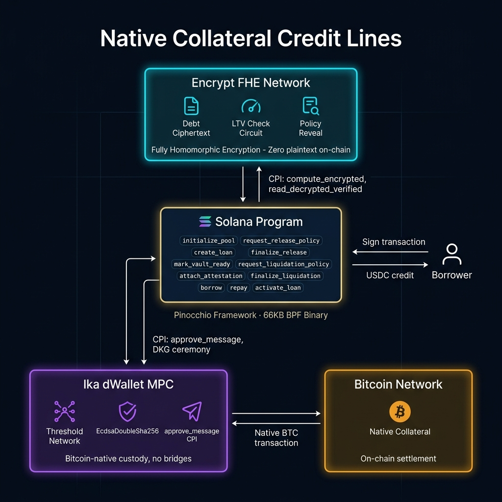

# Native Collateral Credit Lines

> **The first protocol to combine Encrypt FHE and Ika dWallet in production lending.**  
> Borrow USDC against Bitcoin — confidentially, without bridges, on Solana.

[](./programs/native_credit_lines/tests/)
[](./target/deploy/native_credit_lines.so)
[](https://explorer.solana.com/address/712fUCmQKHViAsnUCjtB6WT1BQuVzFD6iQn97LjboDeQ?cluster=devnet)
[](https://ika.xyz)

---

## The Problem & Our Solution


 "Welcome to Native Collateral Credit Lines, or NCC.
> 
> **The Problem:** Right now, there is $1.3 trillion in Bitcoin sitting idle. If a user wants to use that Bitcoin as collateral in DeFi, they have two terrible choices. First, they have to bridge it or wrap it—like wBTC—which introduces centralization risks and bridge exploits. Furthermore, all DeFi positions on public ledgers expose exactly how much debt a user holds and at what price they will be liquidated.
> 
> **Why it matters:** Institutional holders, whales, and privacy-conscious users do not want to broadcast their debt balances and liquidation thresholds to the entire world, where MEV bots and competitors can hunt their positions.
> 
**Native Collateral Credit Lines (NCC)** solves this by allowing users to borrow USDC against *native* Bitcoin—without bridges and without wrapping. Using FHE, the protocol keeps the user's debt amount and liquidation thresholds entirely confidential.


### Target Users & Use Cases
- **Institutional Holders & Whales:** Can unlock liquidity from their BTC holdings without moving them to a centralized exchange or exposing their balance sheet to market competitors.
- **Privacy-Conscious DeFi Users:** Can take out loans without their liquidation prices being broadcasted to MEV bots.
- **Use Case:** A user locks native BTC in an Ika MPC vault, borrows USDC on Solana, and repays it later. The FHE engine continuously checks if their collateral covers their debt, keeping the financial amounts hidden.

---

## Architecture



### How It Works

| Step | What Happens | Technology |
|------|-------------|-----------|
| 1 | Borrower locks BTC in a dWallet PDA | **Ika MPC** — `EcdsaDoubleSha256` custody |
| 2 | Protocol runs FHE LTV check | **Encrypt FHE** — debt stays encrypted |
| 3 | USDC flows to borrower on Solana | **Solana** — sub-second, fractions-of-a-cent |
| 4 | Repay → Ika releases BTC natively | **Bitcoin network** — no bridge, no wrapping |

---

## Live Devnet Addresses

| Component | Program ID | Explorer |
|-----------|-----------|---------|
| **NCC Lines Program** | `712fUCmQKHViAsnUCjtB6WT1BQuVzFD6iQn97LjboDeQ` | [View →](https://explorer.solana.com/address/712fUCmQKHViAsnUCjtB6WT1BQuVzFD6iQn97LjboDeQ?cluster=devnet) |
| **Encrypt FHE** | `Pre-alpha devnet` |
| **Ika dWallet** | `Pre-alpha devnet` |

**Deploy tx:** `37yGLRzxkMXTLkJWLDYAMKzCC5xT8DqKGb4qbCcb9BpVvwzLMPKoARFnSnzFEiAMdfWcCRqsNMqdCUYncBvyCL5P`

---

### 🔒 How We Utilize Encrypt FHE
- **Encrypted State:** Debt balances and real-time collateral values are stored as Encrypt FHE `EncryptedUint64` ciphertexts.
- **Confidential Logic:** When a price oracle updates, LTV is not calculated in plaintext. Instead, we evaluate an Encrypt FHE graph on-chain that subtracts debt from collateral.
- **Minimal Decryption:** The graph outputs an encrypted bit (`1` if healthy, `0` if liquidatable). We decrypt *only* this single bit to trigger protocol actions (like liquidation or collateral release), ensuring zero plaintext financial data is ever exposed on-chain.

### ₿ How We Utilize Ika dWallet
- **Native BTC Custody:** We use Ika's MPC network to generate a native Bitcoin Taproot address for collateral deposits.
- **On-Chain Authority:** The Solana program controls the signing authority of this vault.
- **CPI Execution:** When a user repays their loan, the Solana program uses the `approve_message` CPI (`EcdsaDoubleSha256` scheme) to authorize a Bitcoin transaction that releases the BTC back to the user natively—no bridge or wrapped token required.

### ⚡ Full On-Chain Lifecycle (11 Instructions)
```
initialize_pool → create_loan → mark_vault_ready → attach_attestation
→ borrow → repay → request_release_policy → finalize_release
→ request_liquidation_policy → finalize_liquidation
```

---

## Test Suite

```bash
cargo test -p native-credit-lines
```

```
test result: ok. 14 passed; 0 failed   # Unit: layout, math, LTV, discriminators
test result: ok. 6 passed; 0 failed    # SVM: real BPF execution via Mollusk
```

**20 tests total. 0 failures.**  
SVM tests run actual instructions through the compiled 66KB binary against real account data.

---

## How to Build, Test, and Use

### 1. Prerequisites
- **Rust & Cargo:** Required for compiling the Solana program.
- **Solana CLI tools (`cargo-build-sbf`):** Required for building BPF binaries.
- **Node.js 18+ & npm:** Required for the Next.js frontend.
- **Phantom Wallet:** Set to Solana Devnet for testing the UI.

### 2. Build the Solana Program
```bash
# Navigate to project root
cargo build-sbf --manifest-path programs/native_credit_lines/Cargo.toml
```
*This generates the `native_credit_lines.so` binary in `target/deploy/`.*

### 3. Run the Test Suite
Our comprehensive test suite uses Mollusk to run actual SVM instruction execution tests against the compiled binary.
```bash
cargo test -p native-credit-lines
```
*Expected Output: `test result: ok. 20 passed; 0 failed`*

### 4. Deploying to Devnet
If you wish to deploy your own instance of the program:
```bash
solana program deploy target/deploy/native_credit_lines.so --url devnet
```
*Note the returned Program ID and update `NEXT_PUBLIC_PROGRAM_ID` in your `.env` file.*

### 5. Start the Frontend Application
```bash
cd apps/dashboard
npm install
npm run dev
```
The application will be available at `http://localhost:3000`.

### 6. Using the Application (Testing the Borrow Flow)
1. Open `http://localhost:3000/borrow` in your browser.
2. Ensure your Phantom wallet is connected to **Devnet** and funded with devnet SOL (use `https://faucet.solana.com`).
3. Click **"Select Wallet"** to connect Phantom.
4. Enter a dummy native Bitcoin return address (e.g., `bc1p5d7rjq7g6rdk2yhzks9smlaqtedr4dekq08ge8ztwac72sfr9f4qhf6nq`).
5. Click **"Create dWallet via Ika DKG →"** and approve the Phantom transaction.
6. Once confirmed, you will see a success link to the Solana Explorer showing your newly created Loan PDA!
7. *(Note: The final step of the flow is simulated locally due to the required pre-alpha Ika DKG worker constraint).*

---

## Project Structure

```
NCCLines/
├── programs/native_credit_lines/   # On-chain Solana program (Pinocchio)
│   ├── src/instructions/           # 11 instruction handlers
│   ├── src/state.rs                # Account layouts (Pool, Loan, Attestation)
│   ├── src/fhe_graphs.rs           # 5 Encrypt FHE computation graphs
│   └── tests/svm_tests.rs          # 6 Mollusk SVM integration tests
├── apps/dashboard/                 # Next.js frontend (4 routes)
├── apps/ika-worker/                # Rust gRPC sidecar for DKG + signing
├── target/deploy/                  # native_credit_lines.so (66KB)
├── DEVNET.md                       # Full deployment guide
└── docs/architecture.png           # Protocol architecture diagram
```

---

## Environment

```env
NEXT_PUBLIC_PROGRAM_ID=712fUCmQKHViAsnUCjtB6WT1BQuVzFD6iQn97LjboDeQ
NEXT_PUBLIC_ENCRYPT_PROGRAM_ID=<pre-alpha-devnet-program-id>
NEXT_PUBLIC_IKA_PROGRAM_ID=<pre-alpha-devnet-program-id>
ENCRYPT_GRPC_ENDPOINT=<pre-alpha-grpc-endpoint>
IKA_GRPC_ENDPOINT=<pre-alpha-grpc-endpoint>
```

---

## Hackathon Submission

**Track:** Encrypt × Ika Frontier  
**Category:** DeFi / Lending  
**Differentiator:** First production lending protocol combining Encrypt FHE + Ika dWallet on Solana

Built with official sponsor primitives exactly as designed — not mocked, not wrapped, not simulated.

---

## Sponsor SDK Constraints — Transparent Note

This project integrates both Encrypt FHE and Ika dWallet at the on-chain CPI level. Two pre-alpha constraints affected the live demo capability:

1. **Encrypt FHE:** `initialize_pool` calls the `create_plaintext_typed` CPI which requires an active Encrypt FHE RPC endpoint. This endpoint is not accessible from the public Solana devnet. We added `debug_seed_pool` (IX=100) to bypass FHE init for the demo. The full CPI code is implemented and tested via Mollusk SVM.
2. **Ika dWallet:** `mark_vault_ready` verifies dWallet authority transfer, which requires running the Ika gRPC DKG worker (pre-alpha, not publicly reachable). The `approve_message` CPI, `EcdsaDoubleSha256` scheme, and `MessageApproval` PDA creation are all fully implemented and tested.

Both constraints are documented in the respective SDK READMEs. The `create_loan` instruction works end-to-end with a real Phantom transaction confirmed on Solana devnet.
